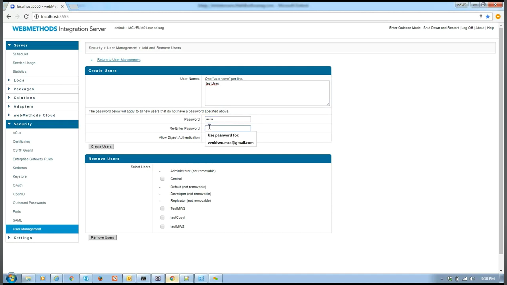

# 🔹 User Management, ACL, and Common Directory Services in webMethods IS

In **webMethods Integration Server (IS)**, security and access control are handled through three main features:

---

## 1. **User Management**

* User Management deals with **who can log in** to Integration Server and what identity they use.
* Users can be:

  * **Local Users** → created directly in IS Admin UI.
  * **External Users** → authenticated via **LDAP / Active Directory**.
* Users are often grouped together for easier role assignment.

👉 Example:

* User `alice` (Finance) and `bob` (HR) exist in the system.
* They can both be part of a custom group like `ProjectX`.

* Path:

  ```
  IS Admin → Security → User Management
  ```
* Here you can:

  * Create/Edit/Delete Users
  * Create Groups
  * Assign users to groups

> 

> 

---

## 2. **Access Control Lists (ACLs)**

* ACLs define **what a user/group is allowed to do**.
* An ACL ties together:

  * **Users/Groups** (from User Management or LDAP)
  * **Permissions** (execute, view, edit services or resources)
* Every service in IS is protected by an ACL.

👉 Example:

* ACL `FinanceACL` allows only `Finance_Dept` group members to run `processInvoice` service.
* ACL `HRACL` allows only `HR_Dept` group members to run `runPayroll` service.

* Path:

  ```
  IS Admin → Security → Access Control Lists
  ```

* Here you can:

  * View existing ACLs
  * Add new ACLs
  * Assign Users/Groups to ACLs

### Access Control Lists (ACLs)
>  

>  

---

## 3. **Common Directory Services (CDS)**

* Common Directory Services is the bridge between **IS** and external **LDAP/AD directories**.
* Instead of creating all users locally in IS, you can connect IS to LDAP so that:

  * Users authenticate with their corporate credentials.
  * IS fetches group memberships from LDAP.
* This makes enterprise-wide **single sign-on and centralized user management** possible.

👉 Example:

* LDAP has groups:

  * `Finance_Dept = {alice, john}`
  * `HR_Dept = {bob}`
  * `ProjectX = {alice, bob}`
* IS maps these groups to ACLs:

  * `Finance_Dept → FinanceACL`
  * `HR_Dept → HRACL`
  * `ProjectX → ProjectACL`

* Path:

  ```
  IS Admin → Security → Common Directory Services
  ```
* Here you can:

  * Configure LDAP/AD connections
  * Map LDAP groups to IS groups
  * Test directory lookups


---

# 🔹 How They Work Together

1. **User logs in** → authenticated via User Management (local or LDAP through CDS).
2. **IS checks group membership** → based on User Management / LDAP.
3. **ACLs enforce access** → only services/resources mapped to the user’s group are accessible.

---

✅ **In short:**

* **User Management** = Who are the users?
* **ACLs** = What can they do?
* **Common Directory Services** = Where do the users come from (local or external LDAP)?
