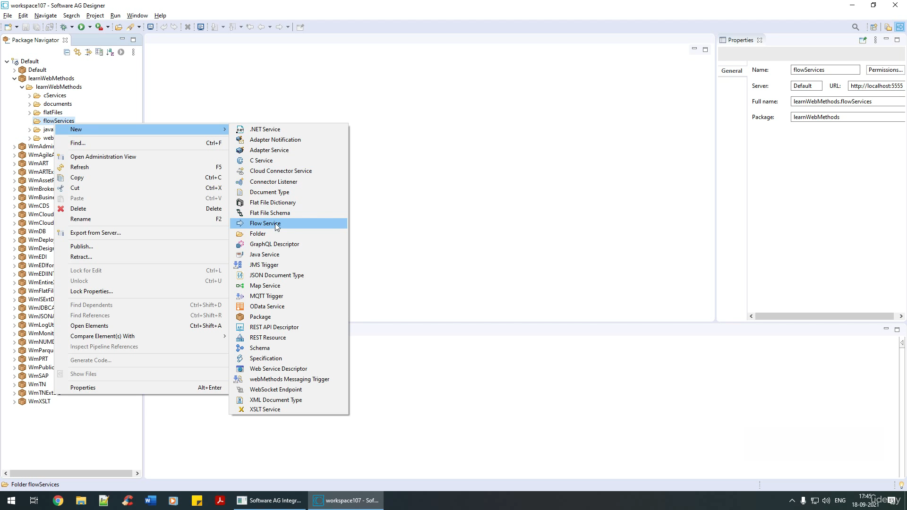

# Flow Services & Flow Steps  
*(webMethods Integration Server / Designer)*

## 1. Definition of a Flow Service  
A *Flow Service* is a service written in the webMethods **flow language**. It allows you to encapsulate a sequence of services within a single service and manage the data flow among them.  
For example, a Flow Service might:  
- Get a purchase order from a buyer  
- Log the order in an audit-trail file  
- Perform a credit check  
- Post the order to an internal ordering system  

> 

Important points:  
- You create Flow Services using Designer (not by editing the XML manually).  
- Flow Services are saved as XML files in a format understood by Designer/Integration Server.  
- They give you a way to integrate, orchestrate and transform data by chaining, branching, looping etc.

## 2. Definition of a Flow Step  
A *Flow Step* is the basic unit of work inside a Flow Service. It is an element in the flow language that the Integration Server interprets and executes at run-time.  
Flow steps fall roughly into two categories:  
1. **Service invocation steps** — e.g., invoking another service.  
2. **Data / control steps** — e.g., mapping, branching, looping, repeating, try/catch, exit.  
Examples of flow steps include: `INVOKE`, `MAP`, `BRANCH`, `LOOP`, `REPEAT`, `SEQUENCE`, `TRY`, `CATCH`, `EXIT`.  
The concept of the *pipeline* is also relevant here: the pipeline is the data structure that carries input, intermediate and output data through the flow service execution.

## 3. How to Create a Flow Service in Designer  
Here is a typical sequence to create a new Flow Service using Designer:  
1. In Designer, choose **File → New → Flow Service** (or right-click in a package/folder → New → Flow Service).  
2. In the *New Flow Service* dialog:  
   - Select the folder/package where the service is to reside.  
   - Specify a name for the service (letters, numbers, underscore allowed).  
   - Optionally, select a template.  
   - (Optional) You can create a Flow Service from a source file (XML, schema, DTD) which auto-generates some logic.  
3. Once created, the Flow Service opens in the Flow Editor (Tree tab or Layout tab).  
4. Define the input/output signature of the service (via the Inputs/Outputs tab) and then build the logic by dragging/pasting flow steps (INVOKE, MAP, etc.).  
5. Save the service; it is now part of the Package and ready to be invoked.

### Some tips/notes  
- Designer provides two views for building flows: the **Tree tab** (default) and the **Layout tab** (graphical). You can use whichever you find easier.  
- The pipeline view is your friend — you can inspect input/output variables, map fields, etc.  
- If you are starting from an XML/Schema source, Designer may create Document Types and set up mapping scaffolding automatically.  
- Good practice: define your service signature clearly (inputs/outputs), keep logic modular, use descriptive names for steps.  
- Note that in some versions you cannot edit the XML manually; use Designer editor only.

** Link: https://community.ibm.com/community/user/viewdocument/webmethods-flow-tutorial-no2-cre?CommunityKey=82b75916-ed06-4a13-8eb6-0190da9f1bfa&tab=librarydocuments
